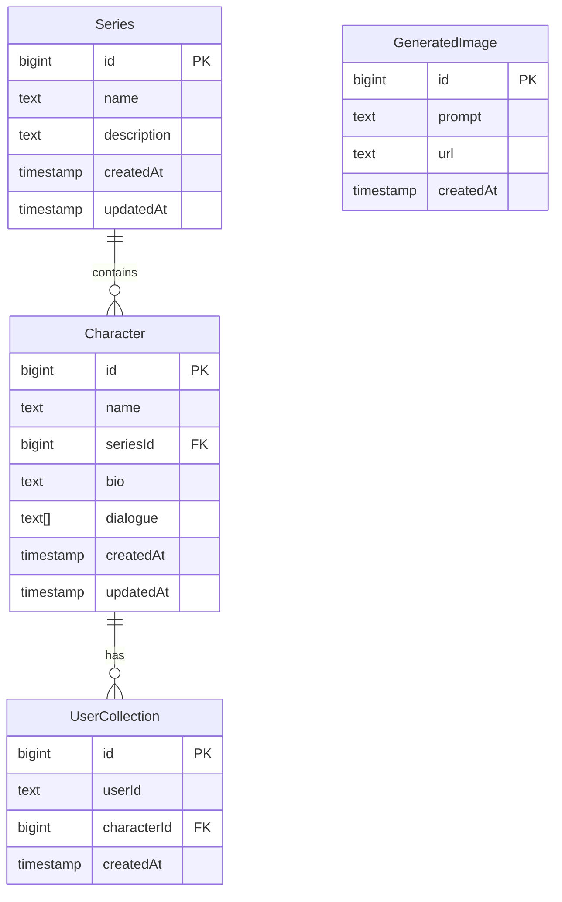

# Sery's Infinite Library - Cursor & Supabase Integration Guide

This guide explains how the Supabase backend is integrated with the application and how to interact with it through Cursor.

## Database Structure

The application uses Supabase with the following schema:

### Tables Overview


### Current Database State
- Tables are set up in Supabase with Row Level Security (RLS) enabled
- Read access is granted to all users
- Write operations require authentication
- Foreign key relationships are established between tables

## Accessing the Database

### Environment Setup
The following environment variables are required:
```env
NEXT_PUBLIC_SUPABASE_URL=your_project_url
NEXT_PUBLIC_SUPABASE_ANON_KEY=your_anon_key
```

### Supabase Client
The client is initialized in `lib/supabase.ts`:
```typescript
import { createClient } from '@supabase/supabase-js'

const supabaseUrl = process.env.NEXT_PUBLIC_SUPABASE_URL!
const supabaseAnonKey = process.env.NEXT_PUBLIC_SUPABASE_ANON_KEY!

export const supabase = createClient(supabaseUrl, supabaseAnonKey)
```

## Common Database Operations

### Character Operations

```typescript
// Fetch all characters
const getCharacters = async () => {
  const { data, error } = await supabase
    .from('Character')
    .select('*, Series(name, description)')
}

// Add new character
const addCharacter = async (character: { name: string, bio: string, seriesId: number }) => {
  const { data, error } = await supabase
    .from('Character')
    .insert([character])
    .select()
}

// Update character
const updateCharacter = async (id: number, updates: Partial<Character>) => {
  const { data, error } = await supabase
    .from('Character')
    .update(updates)
    .eq('id', id)
}

// Delete character
const deleteCharacter = async (id: number) => {
  const { error } = await supabase
    .from('Character')
    .delete()
    .eq('id', id)
}
```

### Series Operations

```typescript
// Fetch all series
const getSeries = async () => {
  const { data, error } = await supabase
    .from('Series')
    .select('*, Character(*)')
}

// Add new series
const addSeries = async (series: { name: string, description: string }) => {
  const { data, error } = await supabase
    .from('Series')
    .insert([series])
    .select()
}
```

### Generated Images

```typescript
// Save generated image
const saveImage = async (image: { prompt: string, url: string }) => {
  const { data, error } = await supabase
    .from('GeneratedImage')
    .insert([image])
}

// Get recent images
const getRecentImages = async (limit = 10) => {
  const { data, error } = await supabase
    .from('GeneratedImage')
    .select()
    .order('createdAt', { ascending: false })
    .limit(limit)
}
```

## Error Handling

Common error patterns to handle:

```typescript
const handleDatabaseOperation = async () => {
  try {
    const { data, error } = await supabase.from('Table').select()
    
    if (error) {
      if (error.code === 'PGRST116') {
        // Handle RLS policy error
        console.error('Access denied by RLS policy')
      } else if (error.code === '23503') {
        // Handle foreign key constraint error
        console.error('Referenced record does not exist')
      } else {
        // Handle other database errors
        console.error('Database error:', error.message)
      }
      return null
    }
    
    return data
  } catch (e) {
    console.error('Unexpected error:', e)
    return null
  }
}
```

## Type Safety

For TypeScript support, define your types based on the database schema:

```typescript
interface Character {
  id: number
  name: string
  seriesId: number
  bio: string | null
  dialogue: string[]
  createdAt: string
  updatedAt: string
  Series?: Series
}

interface Series {
  id: number
  name: string
  description: string | null
  createdAt: string
  updatedAt: string
  Character?: Character[]
}

interface GeneratedImage {
  id: number
  prompt: string
  url: string
  createdAt: string
}

interface UserCollection {
  id: number
  userId: string
  characterId: number
  createdAt: string
  Character?: Character
}
```

## Cursor Integration Notes

When working with this codebase in Cursor:

1. The database schema and types are already set up as shown above
2. Use the `supabase` client from `@/lib/supabase` for all database operations
3. RLS policies are configured to allow read access without authentication
4. Write operations require authentication (currently set up for authenticated users only)
5. All timestamps are in UTC
6. Foreign key relationships are enforced at the database level

For assistance with database operations in new sessions, reference this README and the existing implementation in `db-manager/page.tsx`.
