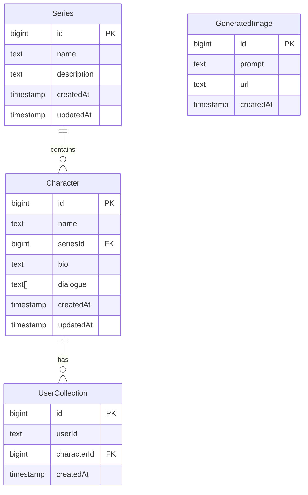

# Sery's Infinite Library

A modern web application that combines creative tools, AI capabilities, and database management. This project showcases the integration of multiple cutting-edge technologies in a user-friendly interface.

## 🌟 Features

### 1. Interactive Drawing (TLDraw)
- Built-in drawing and diagramming tool
- Real-time collaborative features
- Modern canvas interface

### 2. AI Chatbot
- Integration with Grok for intelligent conversations
- Image generation capabilities using Flux
- Interactive chat interface

### 3. Database Management
- Complete Supabase integration
- Visual database management interface
- Real-time data synchronization

## 🛠 Tech Stack

- **Frontend**: Next.js 13+ with App Router
- **UI**: TailwindCSS with custom animations
- **Database**: Supabase
- **Authentication**: Supabase Auth
- **Drawing**: TLDraw
- **AI Integration**: Grok & Flux APIs

## 🏗 Project Structure

```
src/
├── app/
│   ├── chatbot/      # AI chat interface
│   ├── db-manager/   # Database management
│   ├── tldraw/       # Drawing interface
│   └── components/   # Shared components
├── lib/
│   ├── supabase.ts   # Database client
│   └── queries.ts    # Database operations
└── types/           # TypeScript definitions
```

## 🚀 Getting Started

1. Clone the repository
2. Install dependencies:
   ```bash
   npm install
   ```
3. Set up environment variables:
   ```env
   NEXT_PUBLIC_SUPABASE_URL=your_project_url
   NEXT_PUBLIC_SUPABASE_ANON_KEY=your_anon_key
   ```
4. Run the development server:
   ```bash
   npm run dev
   ```

## �� Database Structure & Integration

### Tables Overview


### Current Configuration

#### Tables
1. `Character`
   - Primary table for character information
   - Contains: name, bio, dialogue, etc.
   - Has relationship with Series table

2. `Series`
   - Stores series/show information
   - Contains: name, description
   - One-to-many relationship with Character

3. `GeneratedImage`
   - Stores AI-generated images
   - Contains: prompt, url, creation timestamp

4. `UserCollection`
   - Manages user's saved characters
   - Links users to characters

### Database Operations

#### Querying Data
```typescript
// Basic select
const { data, error } = await supabase
  .from('Character')
  .select('*')
  .limit(50)

// With relationships
const { data, error } = await supabase
  .from('Character')
  .select(`
    *,
    Series (
      name,
      description
    )
  `)
```

#### Pagination
```typescript
const { data, error } = await supabase
  .from('Character')
  .select('*')
  .range(0, 49)  // First 50 records
```

#### Sorting
```typescript
const { data, error } = await supabase
  .from('Character')
  .select('*')
  .order('name', { ascending: true })
```

#### Filtering
```typescript
const { data, error } = await supabase
  .from('Character')
  .select('*')
  .ilike('name', '%search_term%')
```

### Security & RLS Policies

All tables have the following policy:
```sql
alter policy "Enable read access for all users"
on "public".[TABLE_NAME]
to public
using (true);
```

### Error Handling

Common Supabase error codes:
- `PGRST116`: Policy violation
- `23503`: Foreign key violation
- `23505`: Unique constraint violation
- `42P01`: Undefined table
- `42703`: Undefined column

### TypeScript Integration

```typescript
interface Character {
  id: number
  name: string
  seriesId: number
  bio: string | null
  dialogue: string[]
  createdAt: string
  updatedAt: string
  Series?: Series
}

interface Series {
  id: number
  name: string
  description: string | null
  createdAt: string
  updatedAt: string
  Character?: Character[]
}

interface GeneratedImage {
  id: number
  prompt: string
  url: string
  createdAt: string
}

interface UserCollection {
  id: number
  userId: string
  characterId: number
  createdAt: string
  Character?: Character
}
```

### Debugging Tips

1. Check RLS Policies:
   ```sql
   SELECT *
   FROM pg_policies
   WHERE schemaname = 'public';
   ```

2. View Table Permissions:
   ```sql
   SELECT table_name, grantee, privilege_type
   FROM information_schema.role_table_grants
   WHERE table_schema = 'public';
   ```

3. Common Issues:
   - RLS not enabled: Enable with `ALTER TABLE table_name ENABLE ROW LEVEL SECURITY;`
   - Missing policies: Add using the policy template above
   - Relationship errors: Check foreign key constraints

## Accessing the Database

### Environment Setup
The following environment variables are required:
```env
NEXT_PUBLIC_SUPABASE_URL=your_project_url
NEXT_PUBLIC_SUPABASE_ANON_KEY=your_anon_key
```

### Supabase Client
The client is initialized in `lib/supabase.ts`:
```typescript
import { createClient } from '@supabase/supabase-js'

const supabaseUrl = process.env.NEXT_PUBLIC_SUPABASE_URL!
const supabaseAnonKey = process.env.NEXT_PUBLIC_SUPABASE_ANON_KEY!

export const supabase = createClient(supabaseUrl, supabaseAnonKey)
```

## Common Database Operations

### Character Operations

```typescript
// Fetch all characters
const getCharacters = async () => {
  const { data, error } = await supabase
    .from('Character')
    .select('*, Series(name, description)')
}

// Add new character
const addCharacter = async (character: { name: string, bio: string, seriesId: number }) => {
  const { data, error } = await supabase
    .from('Character')
    .insert([character])
    .select()
}

// Update character
const updateCharacter = async (id: number, updates: Partial<Character>) => {
  const { data, error } = await supabase
    .from('Character')
    .update(updates)
    .eq('id', id)
}

// Delete character
const deleteCharacter = async (id: number) => {
  const { error } = await supabase
    .from('Character')
    .delete()
    .eq('id', id)
}
```

### Series Operations

```typescript
// Fetch all series
const getSeries = async () => {
  const { data, error } = await supabase
    .from('Series')
    .select('*, Character(*)')
}

// Add new series
const addSeries = async (series: { name: string, description: string }) => {
  const { data, error } = await supabase
    .from('Series')
    .insert([series])
    .select()
}
```

### Generated Images

```typescript
// Save generated image
const saveImage = async (image: { prompt: string, url: string }) => {
  const { data, error } = await supabase
    .from('GeneratedImage')
    .insert([image])
}

// Get recent images
const getRecentImages = async (limit = 10) => {
  const { data, error } = await supabase
    .from('GeneratedImage')
    .select()
    .order('createdAt', { ascending: false })
    .limit(limit)
}
```

## Error Handling

Common error patterns to handle:

```typescript
const handleDatabaseOperation = async () => {
  try {
    const { data, error } = await supabase.from('Table').select()
    
    if (error) {
      if (error.code === 'PGRST116') {
        // Handle RLS policy error
        console.error('Access denied by RLS policy')
      } else if (error.code === '23503') {
        // Handle foreign key constraint error
        console.error('Referenced record does not exist')
      } else {
        // Handle other database errors
        console.error('Database error:', error.message)
      }
      return null
    }
    
    return data
  } catch (e) {
    console.error('Unexpected error:', e)
    return null
  }
}
```

## Type Safety

For TypeScript support, define your types based on the database schema:

```typescript
interface Character {
  id: number
  name: string
  seriesId: number
  bio: string | null
  dialogue: string[]
  createdAt: string
  updatedAt: string
  Series?: Series
}

interface Series {
  id: number
  name: string
  description: string | null
  createdAt: string
  updatedAt: string
  Character?: Character[]
}

interface GeneratedImage {
  id: number
  prompt: string
  url: string
  createdAt: string
}

interface UserCollection {
  id: number
  userId: string
  characterId: number
  createdAt: string
  Character?: Character
}
```

## Cursor Integration Notes

When working with this codebase in Cursor:

1. The database schema and types are already set up as shown above
2. Use the `supabase` client from `@/lib/supabase` for all database operations
3. RLS policies are configured to allow read access without authentication
4. Write operations require authentication (currently set up for authenticated users only)
5. All timestamps are in UTC
6. Foreign key relationships are enforced at the database level

For assistance with database operations in new sessions, reference this README and the existing implementation in `db-manager/page.tsx`.

## 🔐 Security

- Row Level Security (RLS) enabled on all tables
- Public read access with authenticated write operations
- Secure environment variable management
- Protected API routes

## 🎨 UI/UX Features

- Responsive design for all screen sizes
- Modern gradient animations
- Interactive card layouts
- Star field background animation
- Smooth transitions and hover effects

## 🤝 Contributing

This is a hobbyist project open for learning and collaboration. Feel free to:
- Fork the repository
- Submit pull requests
- Use the code for training AI models
- Suggest improvements

## 📧 Contact

For questions or suggestions, contact the developer:
- Email: qaidlex@gmail.com

## 📝 License

This project is open for AI training and educational purposes.
