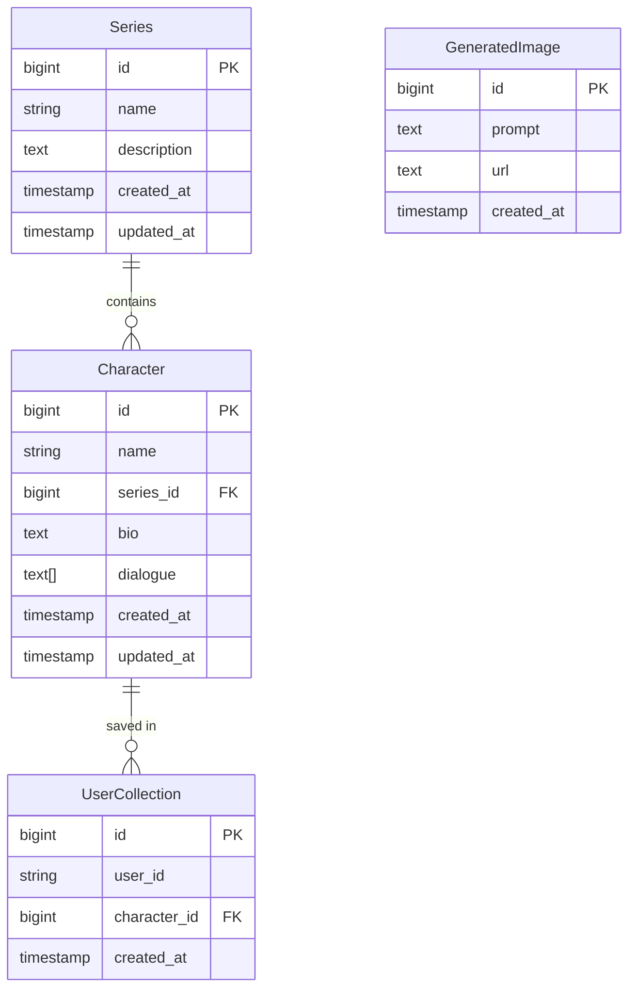

# Database Manager - Supabase Setup

## Current Configuration

### Tables
1. `Character`
   - Primary table for character information
   - Contains: name, bio, dialogue, etc.
   - Has relationship with Series table

2. `Series`
   - Stores series/show information
   - Contains: name, description
   - One-to-many relationship with Character

3. `GeneratedImage`
   - Stores AI-generated images
   - Contains: prompt, url, creation timestamp

4. `UserCollection`
   - Manages user's saved characters
   - Links users to characters

### RLS (Row Level Security) Policies

All tables have the following policy:
```sql
alter policy "Enable read access for all users"
on "public".[TABLE_NAME]
to public
using (true);
```

This allows public read access to all tables while maintaining security.

## Database Operations

### Querying Data
```typescript
// Basic select
const { data, error } = await supabase
  .from('Character')
  .select('*')
  .limit(50)

// With relationships
const { data, error } = await supabase
  .from('Character')
  .select(`
    *,
    Series (
      name,
      description
    )
  `)
```

### Pagination
The database manager uses offset pagination:
```typescript
const { data, error } = await supabase
  .from('Character')
  .select('*')
  .range(0, 49)  // First 50 records
```

### Sorting
```typescript
const { data, error } = await supabase
  .from('Character')
  .select('*')
  .order('name', { ascending: true })
```

### Filtering
```typescript
const { data, error } = await supabase
  .from('Character')
  .select('*')
  .ilike('name', '%search_term%')
```

## Table Relationships



## Error Codes

Common Supabase error codes and their meanings:
- `PGRST116`: Policy violation
- `23503`: Foreign key violation
- `23505`: Unique constraint violation
- `42P01`: Undefined table
- `42703`: Undefined column

## Environment Setup

Required environment variables:
```env
NEXT_PUBLIC_SUPABASE_URL=your_project_url
NEXT_PUBLIC_SUPABASE_ANON_KEY=your_anon_key
```

## Debugging Tips

1. Check RLS Policies:
   ```sql
   SELECT *
   FROM pg_policies
   WHERE schemaname = 'public';
   ```

2. View Table Permissions:
   ```sql
   SELECT table_name, grantee, privilege_type
   FROM information_schema.role_table_grants
   WHERE table_schema = 'public';
   ```

3. Common Issues:
   - RLS not enabled: Enable with `ALTER TABLE table_name ENABLE ROW LEVEL SECURITY;`
   - Missing policies: Add using the policy template above
   - Relationship errors: Check foreign key constraints 